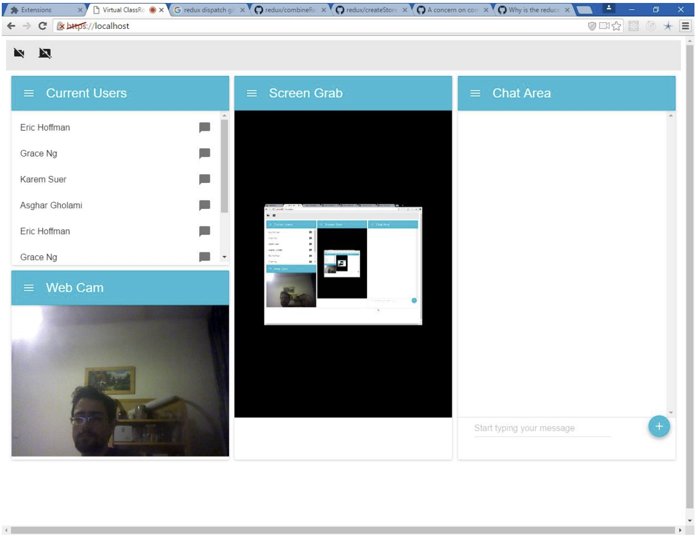

# WebRTC Online Classrooms


A Small Project that leverages the Licode WebRTC communications platform to create virtual classrooms using the relatively new WebRTC standard.

## Technologies
* [react.js](https://facebook.github.io/react/) - a javascript library for building user interfaces
* [redux.js](http://redux.js.org/) - a javascript library for managing application state
* [material-ui](http://material-ui.com/) - s set of react components
* [express.js](http://expressjs.com) - for the applications signalling server
* [socket.io](http://socket.io/) - the whiteboard uses web sockets instead of WebRTC.
* [The Licode WebRTC communications platform](http://lynckia.com/licode/). 

### The Licode WebRTC communications platform
The Licode WebRTC communications platform is basically a media server that acts as an MCU. While WebRTC is traditionally peer to peer,
full-mesh communications are not scalable. Basically a presenter cannot upload multiple video and audio streams to more than a few peers simultaneously
due to bandwidth constraints. So instead the presenter uploads video and audio to the Licode server once and the server which will (presumably)
have a higher bandwidth can send the streams to the peers.

## Features

This project is still under  development. A working feature-complete prototype will be available by August 2016.

## Setting up a development environment 

1. Install a Licode server using the instructions at [http://lynckia.com/licode/install.html](http://lynckia.com/licode/install.html)

    * You'll need to install this on a linux machine, Preferably Ubuntu 14. For development a virtual machine will work fine.
    * This can be the same server you deploy the application's server.
2. Make sure you have NPM and Node installed.
3. Clone this repo

   ```
   git clone https://github.com/amirvt/webrtc-online-classrooms.git
   cd webrtc-online-classrooms/
   npm install
   ```
4. Edit the project [config file](/server/config.js) to match your Licode server setup and change `SERVER_IP` in [/src/constants/serverconstants.js](/src/constants/serverconstants.js) to your node server's ip.  
   In a production enviroment, you should set a new id and secret.  
5. Run `npm install` in the root and [/server](/server)
6. Run the server with `node server/index.js`
7. To run the client in development mode using a webpack server use the `npm start -s` command (This will enable debugging middleware and hot reloading)  
To build the client, run the `npm run build -s` command. This will build the app in the [/dist](/dist) directory. I've set up the express server to statically serve the files in [/dist](/dist). So by default the client is on port 3015 on your signalling server.

    If you're setting up everything on the same server you'll want to change the ports in [/tools/srcServer.js](/tools/srcServer.js) and [/tools/distServer.js](/tools/srcServer.js) to something other than 3000 as the Licode server defaults to 3000.


## Setting up https


### Setting up https for the Licode server

You'll need to do this to be able to use screen capturing.

Open `licode/scripts/licode_default.js`
Change the settings as below:

```javascript
config.erizoController.hostname = 'your_server_hostname_include_domain_name'; //default value: ''
config.erizoController.port = 8443; //default value: 8080
// Use true if clients communicate with erizoController over SSL
config.erizoController.ssl = true; //default value: false
```

```javascript
// This configuration is used by erizoController server to listen for connections
// Use true if erizoController listens in HTTPS. SSL certificates located in /cert
config.erizoController.listen_ssl = true; //default value: false
config.erizoController.listen_port = 8443; //default value: 8080
```

Finally, replace both cert.pem and key.pem in /cert directory with your own cert files. Instructions for creating a self-signed certificate can be found in [this article](https://devcenter.heroku.com/articles/ssl-certificate-self).



